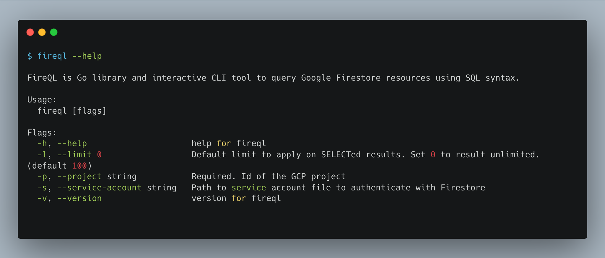

[](https://github.com/pgollangi/FireQL/actions/workflows/build.yml)

[](https://goreportcard.com/report/github.com/pgollangi/FireQL)


[](https://pkg.go.dev/github.com/pgollangi/FireQL)


<!-- [](https://codecov.io/gh/pgollangi/FireQL) -->

# FireQL

`FireQL` is the Golang library and interactive CLI tool to query the Google Firestore database using SQL syntax.

It is built on top of the official [Google Firestore Client SDK](https://pkg.go.dev/cloud.google.com/go/firestore) that will allow running queries Cloud Firestore database using SQL syntax. Inspired by [Firebase FireSQL](https://firebaseopensource.com/projects/jsayol/firesql/).


[](https://asciinema.org/a/548756?cols=150&rows=50)

## Usage

`FireQL` can be used as Go library or interactive command-line tool.

### Go Library
An example of querying collections using SQL syntax:
```go
import (
    "github.com/pgollangi/fireql"
)

func main() {
    fql, err := fireql.New("<GCP_PROJECT_ID>")
    //OR
    fql, err = fireql.New("<GCP_PROJECT_ID>", fireql.OptionServiceAccount("<SERVICE_ACCOUNT_JSON>"))
    if err != nil {
        panic(err)
    }
    
	// Now, execute SELECT query
    result, err := fql.Execute("SELECT * `users` order by id desc limit 10")
    if err != nil {
        panic(err)
    }
    _ = result
}
```

### Command-Line
```bash
fireql [flags]
```
#### Example
```bash
$ fireql --project $PROJECT_ID
Welcome! Use SQL to query Firestore.
Use Ctrl+D, type "exit" to exit.
Visit github.com/pgollangi/FireQL for more details.
fireql>select id, name from users limit 2
+------+------------+
|  ID  |    NAME    |
+------+------------+
| 1046 | bob        |
| 1047 | smith      |
+------+------------+
(2 rows)
fireql>
```
Read the [documentation](https://pgollangi.github.io/FireQL/) for more information on CLI usage.

## Examples
Some cool `SELECT` queries that are possible with `FireQL`:
```sql
select * from users
select * from `[contacts]` // To query collection group. enclose subcollect name in square brackets.
select *, id as user_id from users
select id, email as email_address, `address.city` AS city from `users`
select * from users order by 'address.city' desc limit 10
select * from `users` where id > 50
select id, LENGTH(contacts) as total_contacts from `users`
```
See [Wiki](https://github.com/pgollangi/FireQL/wiki) for more examples.

### Authentication

`fireql.New` assume Google [Application Default Credentials](https://cloud.google.com/docs/authentication/application-default-credentials) to authenticate to Firestore database if `serverAccount` not passed. Otherwise use service account for authentication.

## Installation

### Homebrew
```bash
brew install pgollangi/tap/fireql
```
Updating:
```bash
brew upgrade fireql
```

### Scoop (for windows)
```sql
scoop bucket add pgollangi-bucket https://github.com/pgollangi/scoop-bucket.git
scoop install fireql
```

### Docker
```bash
docker run pgollangi/fireql
```

### Go

```bash
go install github.com/pgollangi/fireql@latest
```

### Manual
You can alternately download a suitable binary for your OS at the [releases page](https://github.com/pgollangi/fireql/releases).

## Limitations
All of [firestore query limitations](https://firebase.google.com/docs/firestore/query-data/queries#query_limitations) are applicable when running queries using `FireQL`.

In addition to that:

- Only `SELECT` queries for now. Support for `INSERT`, `UPDATE`, and `DELETE` might come in the future.
- Only `AND` conditions supported in `WHERE` clause. 
- No support for `JOIN`s.
- `LIMIT` doesn't accept an `OFFSET`, only a single number.
- No support of `GROUP BY` and aggregate function `COUNT`.

## Future scope

- [x] Create an interactive command-line shell to run queries
- [ ] Expand support for all logical conditions in `WHERE` clause by internally issuing multiple query requests to Firestore and merging results locally before returning.
- [ ] `GROUP BY` support
- [ ] Support other DML queries: `INSERT`, `UPDATE`, and `DELETE`


## Contributing
Thanks for considering contributing to this project!

Please read the [Contributions](https://github.com/pgollangi/.github/blob/main/CONTRIBUTING.md) and [Code of conduct](https://github.com/pgollangi/.github/blob/main/CODE_OF_CONDUCT.md).

Feel free to open an issue or submit a pull request!

## Licence

`FireQL` is open-sourced software licensed under the [MIT](LICENSE) license.
